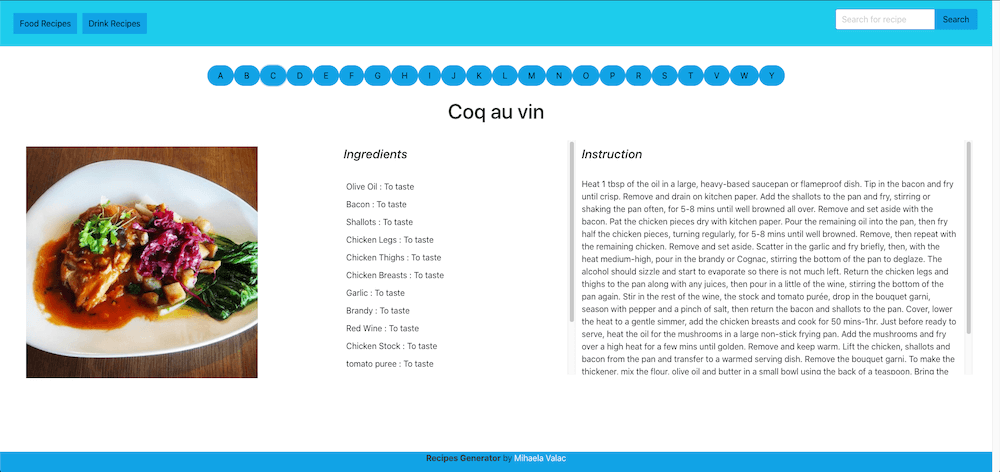
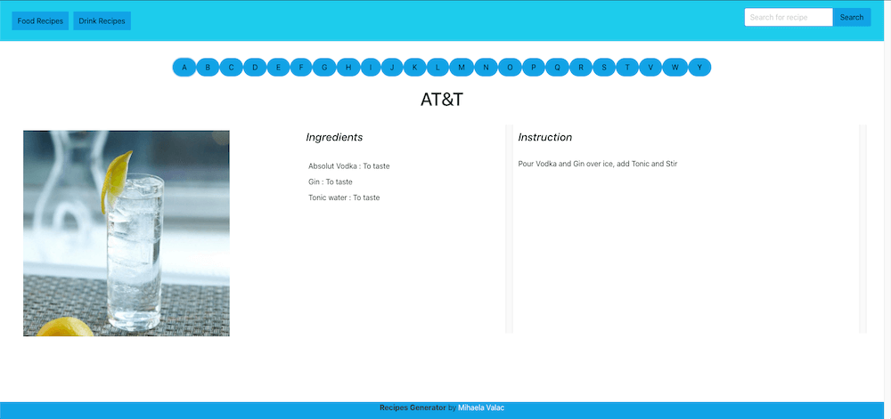

# Recipe Generator

This project is created to help users with their recipes choice! The requirements of the project are to involve at least two API's and a different CSS framework (other than Bootstrap), I selected Bulma. This is one of my first large projects, and because I am a self learner, I wasn't able to build this application with a team, therefor I did it independently. The API's that I used are themealDB and thecocktailDB. The project offers users the opportunity to ether generate a random meal by selecting from a string of letters, or user can introduce the recipe name in the searchbox.  

The meal DB - https://www.themealdb.com/api.php

The cocktail DB - https://www.thecocktaildb.com/api.php

## Website Layout 

When the user access the page for the first time, on the screen display a Welcome Image and an instructive message!

If the user chose to generate a random recipe, the screen displays a string of letters from whish the user should chose the one with which the name of the recipe starts and a image that represents the category of recipe.

For food-recipes:

For cocktail-recipe:

When the user select the desired letter-button, the screen displays a random recipe from the selection. 

Example for the food selection for letters "C", "L" and "R" :

Example for the cocktails selection for letters "A", "E" and "Q" :

